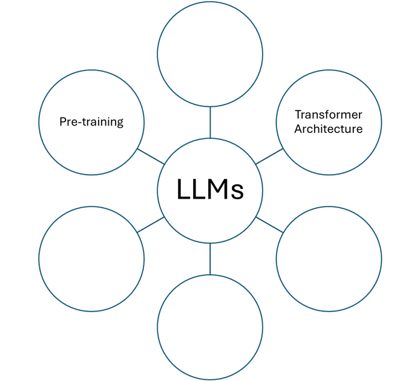

:::::::::::::::::::::::::::::::::::::: questions 

- What are the main features of large language models?
- How is BERT different from GPT models?
- How can I use open-source LLMs, such as LLM examples in huggingface, for research tasks?

::::::::::::::::::::::::::::::::::::::::::::::::

::::::::::::::::::::::::::::::::::::: objectives

- Be able to explain the structure of large language models and their main components
- Identify differences between BERT and GPT.
- Be able to use open-source LLMs, such as huggingface, for text summarization, classification, and generation.

::::::::::::::::::::::::::::::::::::::::::::::::


## 6.1.	Introduction to LLMs

Large Language Models (LLMs) have become a cornerstone of modern natural language processing (NLP). Since the introduction of the transformer architecture in 2017, LLMs have leveraged this design to achieve remarkable language understanding and generation capabilities. In the previous episode, we discussed the transformer architecture, which is integral to all LLMs, utilizing its encoder and decoder components to process language. 

LLMs have several key features.




::::::::::::::::::::::::::::::::::::: challenge

### Challenge

Fill in the above feature placeholders. Discuss what are these key components. Explain the key features in detail and compare your thoughts with the other group members: 

1. Transformer Architecture: A neural network design that uses self-attention mechanisms to weigh the influence of different parts of the input data.
   
2. Pre-training: involves teaching LLMs to anticipate words in sentences, using either bi-directional or uni-directional approaches, (based on the LLM type), without the need for understanding or experience.
   
3. --------------
   
4. --------------
   
5. -------------
    
6. -------------


:::::::::::::::::::::::: solution 


1. Transformer Architecture: A neural network design that uses self-attention mechanisms to weigh the influence of different parts of the input data.

2. Pre-training: involves teaching LLMs to anticipate words in sentences, using either bi-directional or uni-directional approaches, (based on the LLM type), without the need for understanding or experience.
   
3. Word/Token Embedding: The process of converting words or phrases into numerical form (vectors) that computers can understand.

**RECALL** embedding?


[source](https://www.shanelynn.ie/get-busy-with-word-embeddings-introduction/)

   
4. Context Window: The range of words the model considers for predicting the next word or understanding the current word within a sentence.
   
5. Parameters: The aspects of the model that are learned from training data and determine the model’s behavior.
    
6. Transfer Learning: The process LLMs use to apply their prior knowledge to new tasks.

Thus, the completed graph will be:


:::::::::::::::::::::::::::::::::
::::::::::::::::::::::::::::::::::::::::::::::::


::::::::::::::::::::::::::::::::::::: challenge

### Discussion 

Teamwork: What is DSL and why are they useful for research tasks? Think of some examples of NLP tasks that require domain-specific LLMs, such as literature review, patent analysis, or material discovery. How do domain-specific LLMs improve the performance and accuracy of these tasks?


::::::::::::::::::::::::::::::::::::::::::::::::


We can categorize LLMs based on the transformer architecture. Let’s have another look into the transformer architecture, this time we categorize them based on the two main components: **Encoder and Decoder**. LLMs can be designed to handle different tasks based on their underlying transformer blocks and whether they have encoder-only, decoder-only, or encoder-decoder layers. 


::::::::::::::::::::::::::::::::::::: challenge

### Challenge

How do you think we should connect each one of the following transformers to the correct color?


:::::::::::::::::::::::: solution 


:::::::::::::::::::::::::::::::::

::::::::::::::::::::::::::::::::::::::::::::::::


•	Encoders are used for understanding tasks like sentence classification.

•	Decoders excel in generative tasks like text generation.

•	The combination of encoders and decoders in transformers allows them to be versatile and perform a variety of tasks, from translation to summarization, depending on the specific requirements of the task at hand.


::: callout

### Encoder Vs. Decoder and/or BERT Vs. GPT

We will see models like BERT use encoders for bidirectional understanding, and models like GPT use decoders for generating coherent text, making them suitable for chatbots or virtual assistants.

:::


::::::::::::::::::::::::::::::::::::: challenge

### Discussion

Teamwork: Think of some examples of traditional NLP models, such as n-gram models, hidden Markov models, LSTMs, and RNNs. How do large language models differ from them in terms of architecture, data, and performance?


A: Traditional NLP models, such as n-gram models, hidden Markov models (HMMs), Long Short-Term Memory Networks (LSTMs), and Recurrent Neural Networks (RNNs), differ significantly from the recent LLMs. N-gram models predict the next item in a sequence based on the previous ‘n-1’ items without any deep understanding of context. HMMs are statistical models that output probabilities of sequences and are often used for tasks like part-of-speech tagging. LSTMs and RNNs are types of neural networks that can process sequences of data and are capable of learning order dependence in sequence prediction. 


Compared to these traditional models, LLMs have several key differences: 
- **Architecture**: Novel LLMs use transformer architectures, which are more advanced than the simple recurrent units of RNNs or the gated units of LSTMs. Transformers use self-attention to weigh the influence of different parts of the input data, which is more effective for understanding context. 
- **Data**: Novel LLMs are trained on massive datasets, often sourced from the internet, which allows them to learn a wide variety of language patterns, common knowledge, and even reasoning abilities. Traditional models typically use smaller, more curated datasets. 
- **Performance**: Novel LLMs generally outperform traditional models in a wide range of language tasks due to their ability to understand and generate human-like text. They can capture subtleties and complexities of language that simpler models cannot, leading to more accurate and coherent outputs. 

::::::::::::::::::::::::::::::::::::::::::::::::


## 6.2.	BERT

Bidirectional Encoder Representations from Transformers (BERT) is an LLM that uses an encoder-only architecture from transformers. It is designed to understand the context of a word based on all of its surroundings (bidirectional context). Let’s guess the missing words in the text below to comprehend the workings of BERT:


::::::::::::::::::::::::::::::::::::::::: Challenge 

### Challenge

Complete the following paragraph:

“BERT is a revolutionary language model that uses an ______ (encoder) to process words in a sentence. Unlike traditional models, it predicts words based on the ______ rather than in sequence. Its training involves ______, where words are intentionally hidden, or ______, and the model learns to predict them. This results in rich ______ that capture the nuanced meanings of words.”


:::::::::::::::::::::::: solution 

"BERT is a revolutionary language model that uses an **encoder** to process words in a sentence. Unlike traditional models, it predicts words based on the **context** rather than in sequence. Its training involves **self-supervised learning**, where words are intentionally hidden, or **'masked'**, and the model learns to predict them. This results in rich **embeddings** that capture the nuanced meanings of words.”


:::::::::::::::::::::::::::::::::
::::::::::::::::::::::::::::::::::::::::::::::::


::::::::::::::::::::::::::::::::::::::::: spoiler 

### Heads-up: MLM & NSP

Pre-training of language models involves a process where models like BERT and GPT learn to predict words in sentences without specific task training. This is achieved through methods like the Masked Language Model (MLM) for bi-directional models, which predict masked words using surrounding context. MLM in BERT predicts missing words in a sentence by masking them during training. 

For Next Sentence Prediction (NSP) BERT learns to predict if two sentences logically follow each other.

::::::::::::::::::::::::::::::::::::::::::::::


## 6.3. GPT

Generative Pretrained Transformer (GPT) models, on the other hand, use a decoder-only architecture. They excel at generating coherent and contextually relevant text. Check the following table that summarizes three different LLMs. The middle column misses some information about GPT models. With the help of your teammates complete the table and explain the differences in the end.


::::::::::::::::::::::::::::::::::::::::: Challenge

### Challenge

Write in the gray boxes with the correct explanations.


[source](https://medium.com/@reyhaneh.esmailbeigi/bert-gpt-and-bart-a-short-comparison-5d6a57175fca)

:::::::::::::::::::::::: solution 


[source](https://medium.com/@reyhaneh.esmailbeigi/bert-gpt-and-bart-a-short-comparison-5d6a57175fca)


:::::::::::::::::::::::::::::::::
::::::::::::::::::::::::::::::::::::::::::::::::


::::::::::::::::::::::::::::::::::::::::: Challenge 

### Discussion 

Teamwork: From what you learned above how can you explain the differences between the three LLM types? Discuss in groups and share your answers.


A: *We can see it as the processes of trying to understand a conversation (BERT), versus trying to decide what to say next in the conversation (GPT). BERT is like someone who listens to the entire conversation before and after a word to really understand its meaning.* 

*For example, in the sentence “I ate an apple,” BERT would look at both “I ate an” and “apple” to figure out what **“an”** refers to. It’s trained by playing a game of **‘guess the missing word,’** where some words are hidden **(masked)** and it has to use the context to fill in the blanks.* 

*GPT, on the other hand, is like a storyteller who only needs to know what was said before to continue the tale. It would take “I ate an” and **predict that the next word** might be “apple.” It learns by **reading a lot of text** and practicing how to predict the next word in a sentence.* 

*Both are smart in their own ways, but they’re used for different types of language tasks. BERT is great for understanding the **context of words**, while GPT is excellent at **generating new text** based on what it’s seen before. The following schematics demonstrate their performing differences:* 


[source](https://medium.com/@reyhaneh.esmailbeigi/bert-gpt-and-bart-a-short-comparison-5d6a57175fca)


::::::::::::::::::::::::::::::::::::::::::::::::


::::::::::::::::::::::::::::::::::::::::: spoiler 

### How LLMs can be Compared? What is HELM?

Models are often benchmarked using standardized datasets and metrics. The Holistic Evaluation of Language Models (HELM) by Stanford provides a comprehensive framework for evaluating LLMs across multiple dimensions.


[source](https://crfm.stanford.edu/helm/lite/latest/)


GPT-4 models are outperforming other LLM models in terms of accuracy.

::::::::::::::::::::::::::::::::::::::::::::::::


::::::::::::::::::::::::::::::::::::: challenge

### Discussion 

What are some examples of LLMs, and how are they trained and used for research tasks? Consider some of the main features and characteristics of LLMs, such as transformer architecture, self-attention mechanism, pre-training and fine-tuning, and embedding capabilities. How do these features enable LLMs to perform various NLP tasks, such as text classification, text generation, or question answering?

::::::::::::::::::::::::::::::::::::::::::::::::


## 6.4. Open-Source LLMs:

It is very important for researchers to openly have access to capable LLMs for their studies. Fortunately, some companies are supporting open-source LLMs. The BLOOM model, developed by the BigScience Workshop in collaboration with Hugging Face and other organizations, was released on July 6, 2022. It offers a wide range of model sizes, from 1.1 billion to 176 billion parameters, and is licensed under the open RAIL-M v1. BLOOM is known for its instruct models, coding capabilities, customization finetuning, and being open source. It is more openly accessible and benefits from a large community and extensive support. 

On the other hand, the LLaMA model, developed by Meta AI, was released on February 24, 2023. It is available in four sizes: 7 billion, 13 billion, 33 billion, and 65 billion parameters. The license for LLaMA is restricted to noncommercial use, and access is primarily for researchers. Despite its smaller size, LLaMA is parameter-efficient and has outperformed GPT-3 on many benchmarks. However, its accessibility is more gated compared to BLOOM, and community support is limited to approved researchers. 

Now let’s summarize what we learned here in the following table: 


::::::::::::::::::::::::::::::::::::: challenge

### Discussion 

Teamwork: What are the challenges and trade-offs of domain-specific LLMs, such as data availability, model size, and complexity? 

Consider some of the factors that affect the quality and reliability of domain-specific LLMs, such as the amount and quality of domain-specific data, the computational resources and time required for training or fine-tuning, and the generalization and robustness of the model. How do these factors pose problems or difficulties for domain-specific LLMs and how can we overcome them?

::::::::::::::::::::::::::::::::::::::::::::::::


::::::::::::::::::::::::::::::::::::: challenge

### Discussion

Teamwork: What are some available approaches for creating domain-specific LLMs, such as fine-tuning and knowledge distillation? 

Consider some of the main steps and techniques for creating domain-specific LLMs, such as selecting a general LLM, collecting and preparing domain-specific data, training or fine-tuning the model, and evaluating and deploying the model. How do these approaches differ from each other and what are their advantages and disadvantages?

::::::::::::::::::::::::::::::::::::::::::::::::


Let’s try One-shot and Few-shot prompting examples and see how they can help us to enhance the sensitivity of the LLM to our field of study: One-shot prompting involves providing the model with a single example to follow. It’s like giving the model a hint about what you expect. We will go through an example using Hugging Face’s transformers library:

```python
from transformers import pipeline

# Load a pre-trained model and tokenizer
model_name = "gpt2"
generator = pipeline('text-generation', model=model_name)

# One-shot example
prompt = "Translate 'Hello, how are you?' to French:\nBonjour, comment ça va?\nTranslate 'I am learning new things every day' to French:"
result = generator(prompt, max_length=100)

# Output the result
print(result[0]['generated_text'])
```

In this example, we provide the model with one translation example and then ask it to translate a new sentence. The model uses the context from the one-shot example to generate the translation. 

But what if we have a Few-Shot Prompting? Few-shot prompting gives the model several examples to learn from. This can improve the model’s ability to understand and complete the task. Here is how you can implement few-shot prompting:

```python

from transformers import pipeline

# Load a pre-trained model and tokenizer
model_name = "gpt2"
generator = pipeline('text-generation', model=model_name)

# Few-shot examples
prompt = """\
Q: What is the capital of France?
A: Paris.

Q: What is the largest mammal?
A: Blue whale.

Q: What is the human body's largest organ?
A: The skin.

Q: What is the currency of Japan?
A:"""
result = generator(prompt, max_length=100)

# Output the result
print(result[0]['generated_text'])
```

In this few-shot example, we provide the model with three question-answer pairs before posing a new question. The model uses the pattern it learned from the examples to answer the new question.


::::::::::::::::::::::::::::::::::::: challenge

## Challenge

To summarize this approach in a few steps, fill in the following gaps:
1.	Choose a Model: Select a **---** model from Hugging Face that suits your task.
   
2.	Load the Model: Use the **---** function to load the model and tokenizer.
  
3.	Craft Your Prompt: Write a **---** that includes one or more examples, depending on whether you’re doing one-shot or few-shot prompting.
  
4.	Generate Text: Call the **---** with your prompt to generate the **---**.
  
5.	Review the Output: Check the generated text to see if the model followed the **---** correctly.


:::::::::::::::::::::::: solution 

1.	Choose a Model: Select a **pre-trained** model from Hugging Face that suits your task.
   
2.	Load the Model: Use the **pipeline** function to load the model and tokenizer.
  
3.	Craft Your Prompt: Write a **prompt** that includes one or more examples, depending on whether you’re doing one-shot or few-shot prompting.
  
4.	Generate Text: Call the **generator** with your prompt to generate the **output**.
  
5.	Review the Output: Check the generated text to see if the model followed the **examples** correctly.

:::::::::::::::::::::::::::::::::
::::::::::::::::::::::::::::::::::::::::::::::::


::::::::::::::::::::::::::::::::::::::::: spoiler 

## Why Prompting Quality is important?

Remember, the quality of the output heavily depends on the quality and relevance of the examples you provide. It’s also important to note that larger models tend to perform better at these tasks due to their greater capacity to understand and generalize from examples.

::::::::::::::::::::::::::::::::::::::::::::::::


::::::::::::::::::::::::::::::::::::: keypoints 

- Domain-specific LLMs are essential for tasks that require specialized knowledge.
- Prompt engineering, RAG, fine-tuning, and training from scratch are viable approaches to creating DSLs.
- A mixed prompting-RAG approach is often preferred for its balance between performance and resource efficiency.
- Training from scratch offers the highest quality output but requires significant resources.

::::::::::::::::::::::::::::::::::::::::::::::::

<!-- Collect your link references at the bottom of your document -->
