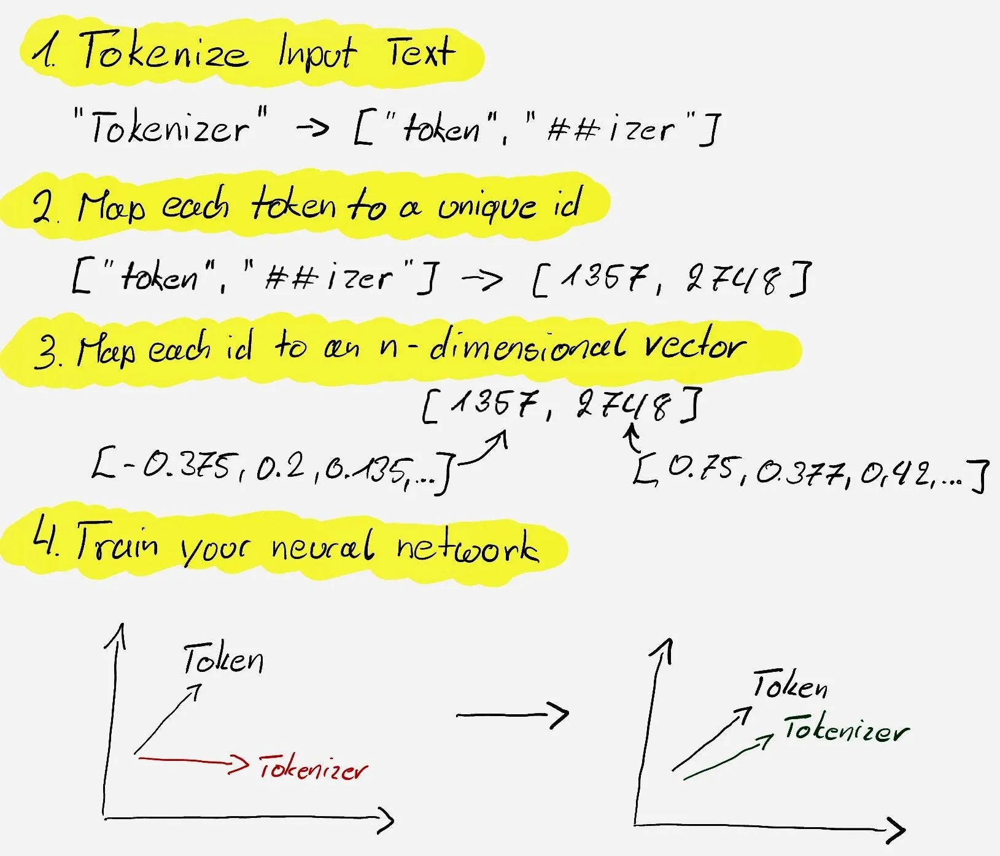

:::::::::::::::::::::::::::::::::::::: questions 

- What is a vector space in the context of NLP?
- How can I visualize vector space in a 2D model?
- How can I use embeddings and how do embeddings capture the meaning of words?

::::::::::::::::::::::::::::::::::::::::::::::::

::::::::::::::::::::::::::::::::::::: objectives

- Be able to explain vector space and how it is related to text analysis.
- Identify the tools required for text embeddings.
- To explore the Word2Vec algorithm and its advantages over traditional models.

::::::::::::::::::::::::::::::::::::::::::::::::


[source](https://carpentries-incubator.github.io/python-text-analysis/06-lsa/index.html)

## 4.1.	Introduction to Vector Space & Embeddings:

We have discussed how tokenization works and how it is important in text analysis, however, this is not the whole story of preprocessing. For conducting robust and reliable text analysis with NLP models, vectorization and embedding are required after tokenization. To understand this concept, we first talk about vector space. 

Vector space models represent text data as vectors, which can be used in various machine learning algorithms. Embeddings are dense vectors that capture the semantic meanings of words based on their context. 


[source](https://www.deeplearning.ai/resources/natural-language-processing/)


::::::::::::::::::::::::::::::::::::: challenge

## Discussion 
Teamwork: Discuss how tokenization affects the representation of text in vector space models. Consider the impact of ignoring common words (stop words) and the importance of word order.


:::::::::::::::::::::::: solution 


[source](https://medium.com/@saschametzger/what-are-tokens-vectors-and-embeddings-how-do-you-create-them-e2a3e698e037)

A: Ignoring stop words might lead to loss of some contextual information but can also reduce noise.
Preserving word order can be crucial for understanding the meaning, especially in languages with flexible syntax.

:::::::::::::::::::::::::::::::::
::::::::::::::::::::::::::::::::::::::::::::::::


:::::::::::::::::::::::::::::::::::::::::: spoiler

### Tell me MORE!

Tokenization is a fundamental step in the processing of text for vector space models. It involves breaking down a string of text into individual units, or “tokens,” which typically represent words or phrases. Here’s how tokenization impacts the representation of text in vector space models:

- *Granularity*: Tokenization determines the granularity of text representation. Finer granularity (e.g., splitting on punctuation) can capture more nuances but may increase the dimensionality of the vector space.
- *Dimensionality*: Each unique token becomes a dimension in the vector space. The choice of tokenization can significantly affect the number of dimensions, with potential implications for computational efficiency and the “curse of dimensionality.”
- *Semantic Meaning*: Proper tokenization ensures that semantically significant units are captured as tokens, which is crucial for the model to understand the meaning of the text.

Ignoring common words, or “stop words,” can also have a significant impact:

*Noise Reduction*: Stop words are often filtered out to reduce noise since they usually don’t carry important meaning and are highly frequent (e.g., “the,” “is,” “at”).

*Focus on Content Words*: By removing stop words, the model can focus on content words that carry the core semantic meaning, potentially improving the performance of tasks like information retrieval or topic modeling.

*Computational Efficiency*: Ignoring stop words reduces the dimensionality of the vector space, which can make computations more efficient.

The importance of word order is another critical aspect:

*Contextual Meaning*: Word order is essential for capturing the syntactic structure and meaning of a sentence. Traditional bag-of-words models ignore word order, which can lead to a loss of contextual meaning.

*Phrase Identification*: Preserving word order allows for the identification of multi-word expressions and phrases that have distinct meanings from their constituent words.

*Word Embeddings*: Advanced models like word embeddings (e.g., Word2Vec) and contextual embeddings (e.g., BERT) can capture word order to some extent, leading to a more nuanced understanding of text semantics.

In summary, tokenization, the treatment of stop words, and the consideration of word order are all crucial factors that influence how text is represented in vector space models, affecting both the quality of the representation and the performance of downstream tasks.

::::::::::::::::::::::::::::::::::::::::::::::::::


::: callout

## Tokenization Vs. Vectorization Vs. Embedding

Initially, **tokenization** breaks down text into discrete elements, or tokens, which can include words, phrases, symbols, and even punctuation, each represented by a unique numerical identifier. These tokens are then mapped to **vectors** of real numbers within an n-dimensional space, a process that is part of **embedding**. During model training, these vectors are adjusted to reflect the semantic similarities between tokens, positioning those with similar meanings closer together in the embedding space. This allows the model to grasp the nuances of language and transforms raw text into a format that machine learning algorithms can interpret, paving the way for advanced text analysis and understanding.


[source](https://geoffrey-geofe.medium.com/tokenization-vs-embedding-understanding-the-differences-and-their-importance-in-nlp-b62718b5964a)

:::


## 4.2. Bag of Words & TF-IDF:
Feature extraction in machine learning involves creating numerical features that describe a document’s relationship to its corpus. Traditional methods like Bag-of-Words and TF-IDF count words or n-grams, with the latter assigning weights based on a word’s importance, calculated by Term Frequency (TF) and Inverse Document Frequency (IDF). TF measures a word’s importance within a document, while IDF assesses its rarity across the corpus. 


[source](https://www.deeplearning.ai/resources/natural-language-processing/)


The product of TF and IDF gives the TF-IDF score, which balances a word’s frequency in a document against its commonness in the corpus. This approach helps to highlight significant words while diminishing the impact of commonly used words like “the” or “a.” 

::::::::::::::::::::::::::::::::::::: instructor

 - **BoW** "encodes the total number of times a document uses each word in the associated corpus through the CounterVectorizer."
 - **TF-IDF** "creates features for each document based on how often each word shows up in a document versus the entire corpus.
 - [source](https://www.deeplearning.ai/resources/natural-language-processing/)

:::::::::::::::::::::::::::::::::::::::::::::::::


::::::::::::::::::::::::::::::::::::: challenge

## Discussion

Teamwork: Discuss how each method represents the importance of words and the potential impact on sentiment analysis. 

:::::::::::::::: solution

A: To compare the Bag of Words (BoW) and Term Frequency-Inverse Document Frequency (TF-IDF) methods in representing text data and their implications for sentiment analysis. 

Data Collection: Gather a corpus of product reviews. For this activity, let’s assume we have a list of reviews stored in a variable called reviews. Clean the text data by removing punctuation, converting to lowercase, and possibly removing stop words. Use a vectorizer to convert the reviews into a BoW representation. 

Discuss how BoW represents the frequency of words without considering the context or rarity across documents. Use a vectorizer to convert the same reviews into a TF-IDF representation. Discuss how TF-IDF represents the importance of words by considering both the term frequency and how unique the word is across all documents. 

:::::::::::::::::::::::::
:::::::::::::::::::::::::::::::::::::::::::::::

::::::::::::::::::::::::::::::::::::: challenge

## Teamwork

Sentiment Analysis Implications:

Analyze a corpus of product reviews using both BoW and TF-IDF. Consider how the lack of context in BoW might affect sentiment analysis. Evaluate whether TF-IDF’s emphasis on unique words improves the model’s ability to understand sentiment. 

Share Findings: Groups should present their findings, highlighting the strengths and weaknesses of each method.


:::::::::::::::: solution

```python

from sklearn.feature_extraction.text import CountVectorizer, TfidfVectorizer

# Sample corpus of product reviews
reviews = [
"Great product, really loved it!",
"Bad quality, totally disappointed.",
"Decent product for the price.",
"Excellent quality, will buy again!"
]

# Initialize the CountVectorizer for BoW
bow_vectorizer = CountVectorizer(stop_words='english')

# Fit and transform the reviews
bow_matrix = bow_vectorizer.fit_transform(reviews)

# Display the BoW matrix
print("Bag of Words Matrix:")
print(bow_matrix.toarray())

# Initialize the TfidfVectorizer for TF-IDF
tfidf_vectorizer = TfidfVectorizer(stop_words='english')

# Fit and transform the reviews
tfidf_matrix = tfidf_vectorizer.fit_transform(reviews)

# Display the TF-IDF matrix
print("\nTF-IDF Matrix:")
print(tfidf_matrix.toarray())

```
:::::::::::::::::::::::::
:::::::::::::::::::::::::::::::::::::::::::::::

The BoW matrix shows the frequency of each word in the reviews, disregarding context and word importance. The TF-IDF matrix shows the weighted importance of words, giving less weight to common words and more to unique ones. 

In sentiment analysis, BoW might misinterpret sentiments due to ignoring context, while TF-IDF might capture nuances better by emphasizing words that are significant in a particular review. 

By comparing BoW and TF-IDF, participants can gain insights into how each method processes text data and their potential impact on NLP tasks like sentiment analysis. This activity encourages critical thinking about feature representation in machine learning models. 


## 4.3. Word2Vec Algorithm:

More advanced techniques like Word2Vec and GLoVE, as well as feature learning during neural network training, have also been developed to improve feature extraction. 

Word2Vec uses neural networks to learn word associations from large text corpora. It has two architectures: Skip-Gram and Continuous Bag-of-Words (CBOW). 

After training, it discards the final layer and outputs word embeddings that capture context. These embeddings capture the context of words, making similar contexts yield similar embeddings. Post-data preprocessing, these numerical features can be used in various NLP models for tasks like classification or named entity recognition. 

Now let’s see how this framework can be used in practice. First import required libraries: Start by importing necessary libraries like gensim for Word2Vec and nltk for tokenization. Next, prepare the data: Tokenize your text data into words. 


```python

from gensim.models import Word2Vec
from nltk.tokenize import word_tokenize
# Sample text
text = "Tokenization splits text into words. Embeddings capture semantic meaning."
# Tokenize the text
tokens = word_tokenize(text.lower())


```


Now train the model: Use the Word2Vec class from gensim to train your model on the tokenized sentences.

```python

from gensim.models import Word2Vec
from nltk.tokenize import word_tokenize
# Sample text
text = "Tokenization splits text into words. Embeddings capture semantic meaning."
# Tokenize the text
tokens = word_tokenize(text.lower())

```


Retrieve Vectors: After training, use the model to get vectors for words of interest.

```python

# Display the vector
print(vector_embeddings)

```

The code tokenizes the sample text, trains a Word2Vec model, and retrieves the vector for the word ‘embeddings’. 

The resulting vector is a 50-dimensional representation of ‘embeddings’, capturing its context within the sample text. This vector can then be used in various NLP tasks to represent the semantic meaning of the word ‘embeddings’.

By understanding the roles of tokenization and embedding, we can better prepare text data for complex NLP tasks and build models that more accurately interpret human language.


:::::::::::::::::::::::::::::::::::::::::: spoiler

## What is GLoVE? 

Global Vectors for Word Representation (GLoVE)

GLoVE is a model for learning word embeddings, which are representations of words in the form of high-dimensional vectors. Unlike Word2Vec, which uses a neural network to learn word embeddings from local context information, GLoVE is designed to capture both global statistics and local context. Here’s how GLoVE stands out: 

- Matrix Factorization: GLoVE uses matrix factorization on a word co-occurrence matrix that reflects how often each word appears in the context of every other word within a large corpus.
- Global Word-Word Co-Occurrence: It focuses on word-to-word co-occurrence globally across the entire corpus, rather than just within a local context window as in Word2Vec.
- Weighting Function: GLoVE employs a weighting function that helps to address the disparity in word co-occurrence frequencies, giving less weight to rare and frequent co-occurrences.

The main difference between GLoVE and Word2Vec is that GLoVE is built on the idea that word meanings can be derived from their co-occurrence probabilities with other words, and hence it incorporates global corpus statistics, whereas Word2Vec relies more on local context information. This allows GLoVE to effectively capture both the semantic and syntactic relationships between words, making it powerful for various natural language processing tasks.

::::::::::::::::::::::::::::::::::::::::::::::::::

::::::::::::::::::::::::::::::::::::: keypoints 

- Tokenization is crucial for converting text into a format usable by machine learning models.
- BoW and TF-IDF are fundamental techniques for feature extraction in NLP.
- Word2Vec and GloVE generate embeddings that encapsulate word meanings based on context and co-occurrence, respectively.
- Understanding these concepts is essential for building effective NLP models that can interpret and process human language.

::::::::::::::::::::::::::::::::::::::::::::::::


<!-- Collect your link references at the bottom of your document -->
