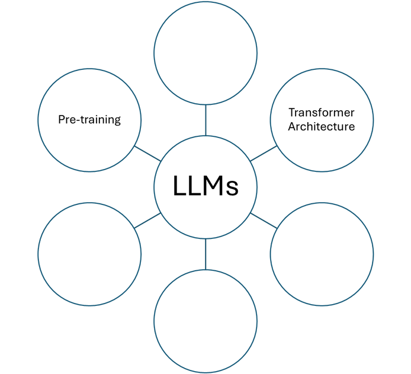
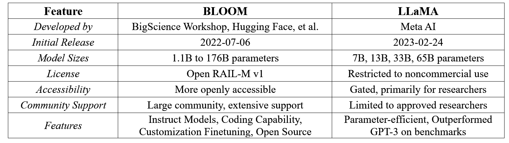

:::::::::::::::::::::::::::::::::::::: questions 

- What are the main features of large language models?
- How is BERT different from GPT models?
- How can I use open-source LLMs, such as LLM examples in huggingface, for research tasks?

::::::::::::::::::::::::::::::::::::::::::::::::

::::::::::::::::::::::::::::::::::::: objectives

- Be able to explain the structure of large language models and their main components
- Identify differences between BERT and GPT.
- Be able to use open-source LLMs, such as huggingface, for text summarization, classification, and generation.

::::::::::::::::::::::::::::::::::::::::::::::::


## 6.1.	Introduction to LLMs

Large Language Models (LLMs) have become a cornerstone of modern natural language processing (NLP). Since the introduction of the transformer architecture in 2017, LLMs have leveraged this design to achieve remarkable language understanding and generation capabilities. In the previous episode, we discussed the transformer architecture, which is integral to all LLMs, utilizing its encoder and decoder components to process language. 

LLMs have several key features.




::::::::::::::::::::::::::::::::::::: challenge

### Challenge

Fill in the above feature placeholders. Discuss what are these key components. Explain the key features in detail and compare your thoughts with the other group members: 

1. Transformer Architecture: A neural network design that uses self-attention mechanisms to weigh the influence of different parts of the input data.
   
2. Pre-training: involves teaching LLMs to anticipate words in sentences, using either bi-directional or uni-directional approaches, (based on the LLM type), without the need for understanding or experience.
   
3. --------------
   
4. --------------
   
5. -------------
    
6. -------------


:::::::::::::::::::::::: solution 


1. Transformer Architecture: A neural network design that uses self-attention mechanisms to weigh the influence of different parts of the input data.

2. Pre-training: involves teaching LLMs to anticipate words in sentences, using either bi-directional or uni-directional approaches, (based on the LLM type), without the need for understanding or experience.
   
3. Word/Token Embedding: The process of converting words or phrases into numerical form (vectors) that computers can understand.

**RECALL** embedding?


[source](https://www.shanelynn.ie/get-busy-with-word-embeddings-introduction/)

   
4. Context Window: The range of words the model considers for predicting the next word or understanding the current word within a sentence.
   
5. Parameters: The aspects of the model that are learned from training data and determine the model’s behavior.
    
6. Transfer Learning: The process LLMs use to apply their prior knowledge to new tasks.

Thus, the completed graph will be:


:::::::::::::::::::::::::::::::::
::::::::::::::::::::::::::::::::::::::::::::::::


::::::::::::::::::::::::::::::::::::: challenge

### Discussion 

Teamwork: What is DSL and why are they useful for research tasks? Think of some examples of NLP tasks that require domain-specific LLMs, such as literature review, patent analysis, or material discovery. How do domain-specific LLMs improve the performance and accuracy of these tasks?


::::::::::::::::::::::::::::::::::::::::::::::::


We can categorize LLMs based on the transformer architecture. Let’s have another look into the transformer architecture, this time we categorize them based on the two main components: **Encoder and Decoder**. LLMs can be designed to handle different tasks based on their underlying transformer blocks and whether they have encoder-only, decoder-only, or encoder-decoder layers. 


::::::::::::::::::::::::::::::::::::: challenge

### Challenge

How do you think we should connect each one of the following transformers to the correct color?


:::::::::::::::::::::::: solution 


:::::::::::::::::::::::::::::::::

::::::::::::::::::::::::::::::::::::::::::::::::


•	Encoders are used for understanding tasks like sentence classification.

•	Decoders excel in generative tasks like text generation.

•	The combination of encoders and decoders in transformers allows them to be versatile and perform a variety of tasks, from translation to summarization, depending on the specific requirements of the task at hand.


::: callout

### Encoder Vs. Decoder and/or BERT Vs. GPT

We will see models like BERT use encoders for bidirectional understanding, and models like GPT use decoders for generating coherent text, making them suitable for chatbots or virtual assistants.

:::


::::::::::::::::::::::::::::::::::::: challenge

### Discussion

Teamwork: Think of some examples of traditional NLP models, such as n-gram models, hidden Markov models, LSTMs, and RNNs. How do large language models differ from them in terms of architecture, data, and performance?


A: Traditional NLP models, such as n-gram models, hidden Markov models (HMMs), Long Short-Term Memory Networks (LSTMs), and Recurrent Neural Networks (RNNs), differ significantly from the recent LLMs. N-gram models predict the next item in a sequence based on the previous ‘n-1’ items without any deep understanding of context. HMMs are statistical models that output probabilities of sequences and are often used for tasks like part-of-speech tagging. LSTMs and RNNs are types of neural networks that can process sequences of data and are capable of learning order dependence in sequence prediction. 


Compared to these traditional models, LLMs have several key differences: 
- **Architecture**: Novel LLMs use transformer architectures, which are more advanced than the simple recurrent units of RNNs or the gated units of LSTMs. Transformers use self-attention to weigh the influence of different parts of the input data, which is more effective for understanding context. 
- **Data**: Novel LLMs are trained on massive datasets, often sourced from the internet, which allows them to learn a wide variety of language patterns, common knowledge, and even reasoning abilities. Traditional models typically use smaller, more curated datasets. 
- **Performance**: Novel LLMs generally outperform traditional models in a wide range of language tasks due to their ability to understand and generate human-like text. They can capture subtleties and complexities of language that simpler models cannot, leading to more accurate and coherent outputs. 

::::::::::::::::::::::::::::::::::::::::::::::::


## 6.2.	BERT

Bidirectional Encoder Representations from Transformers (BERT) is an LLM that uses an encoder-only architecture from transformers. It is designed to understand the context of a word based on all of its surroundings (bidirectional context). Let’s guess the missing words in the text below to comprehend the workings of BERT:


::::::::::::::::::::::::::::::::::::: challenge

### Challenge

Complete the following paragraph:

“BERT is a revolutionary language model that uses an ______ (encoder) to process words in a sentence. Unlike traditional models, it predicts words based on the ______ rather than in sequence. Its training involves ______, where words are intentionally hidden, or ______, and the model learns to predict them. This results in rich ______ that capture the nuanced meanings of words.”


:::::::::::::::::::::::: solution 

"BERT is a revolutionary language model that uses an **encoder** to process words in a sentence. Unlike traditional models, it predicts words based on the **context** rather than in sequence. Its training involves **self-supervised learning**, where words are intentionally hidden, or **'masked'**, and the model learns to predict them. This results in rich **embeddings** that capture the nuanced meanings of words.”


:::::::::::::::::::::::::::::::::
::::::::::::::::::::::::::::::::::::::::::::::::


::::::::::::::::::::::::::::::::::::::::: spoiler 

### Heads-up: MLM & NSP

Pre-training of language models involves a process where models like BERT and GPT learn to predict words in sentences without specific task training. This is achieved through methods like the Masked Language Model (MLM) for bi-directional models, which predict masked words using surrounding context. MLM in BERT predicts missing words in a sentence by masking them during training. 

For Next Sentence Prediction (NSP) BERT learns to predict if two sentences logically follow each other.

::::::::::::::::::::::::::::::::::::::::::::::


## 6.3. GPT

Generative Pretrained Transformer (GPT) models, on the other hand, use a decoder-only architecture. They excel at generating coherent and contextually relevant text. Check the following table that summarizes three different LLMs. The middle column misses some information about GPT models. With the help of your teammates complete the table and explain the differences in the end.


::::::::::::::::::::::::::::::::::::: challenge

### Challenge

Write in the gray boxes with the correct explanations.


[source](https://medium.com/@reyhaneh.esmailbeigi/bert-gpt-and-bart-a-short-comparison-5d6a57175fca)

:::::::::::::::::::::::: solution 


[source](https://medium.com/@reyhaneh.esmailbeigi/bert-gpt-and-bart-a-short-comparison-5d6a57175fca)


:::::::::::::::::::::::::::::::::
::::::::::::::::::::::::::::::::::::::::::::::::


::::::::::::::::::::::::::::::::::::: challenge

### Discussion 

Teamwork: From what you learned above how can you explain the differences between the three LLM types? Discuss in groups and share your answers.


A: *We can see it as the processes of trying to understand a conversation (BERT), versus trying to decide what to say next in the conversation (GPT). BERT is like someone who listens to the entire conversation before and after a word to really understand its meaning.* 

*For example, in the sentence “I ate an apple,” BERT would look at both “I ate an” and “apple” to figure out what **“an”** refers to. It’s trained by playing a game of **‘guess the missing word,’** where some words are hidden **(masked)** and it has to use the context to fill in the blanks.* 

*GPT, on the other hand, is like a storyteller who only needs to know what was said before to continue the tale. It would take “I ate an” and **predict that the next word** might be “apple.” It learns by **reading a lot of text** and practicing how to predict the next word in a sentence.* 

*Both are smart in their own ways, but they’re used for different types of language tasks. BERT is great for understanding the **context of words**, while GPT is excellent at **generating new text** based on what it’s seen before. The following schematics demonstrate their performing differences:* 


[source](https://medium.com/@reyhaneh.esmailbeigi/bert-gpt-and-bart-a-short-comparison-5d6a57175fca)


::::::::::::::::::::::::::::::::::::::::::::::::


::::::::::::::::::::::::::::::::::::::::: spoiler 

### How LLMs can be Compared? What is HELM?

Models are often benchmarked using standardized datasets and metrics. The Holistic Evaluation of Language Models (HELM) by Stanford provides a comprehensive framework for evaluating LLMs across multiple dimensions.


[source](https://crfm.stanford.edu/helm/lite/latest/)


GPT-4 models are outperforming other LLM models in terms of accuracy.

::::::::::::::::::::::::::::::::::::::::::::::::


::::::::::::::::::::::::::::::::::::: challenge

### Discussion 

What are some examples of LLMs, and how are they trained and used for research tasks? Consider some of the main features and characteristics of LLMs, such as transformer architecture, self-attention mechanism, pre-training and fine-tuning, and embedding capabilities. How do these features enable LLMs to perform various NLP tasks, such as text classification, text generation, or question answering?

::::::::::::::::::::::::::::::::::::::::::::::::


::::::::::::::::::::::::::::::::::::: challenge

### Challenge

How can we compare different LLMs? Are there any benchmarks? 

:::::::::::::::::::::::: solution 

A: Comparing Performance (Benchmarking):
1.	Performance can be compared based on the model’s architecture, computational efficiency, and suitability for specific tasks.
2.	Benchmarks and leaderboards (such as HELM) can provide insights into how different models perform on standardized datasets.
3.	Community feedback and use-case studies can also inform the practical effectiveness of different LLMs.


:::::::::::::::::::::::::::::::::
::::::::::::::::::::::::::::::::::::::::::::::::


## 6.4. Open-Source LLMs:

It is very important for researchers to openly have access to capable LLMs for their studies. Fortunately, some companies are supporting open-source LLMs. The BLOOM model, developed by the BigScience Workshop in collaboration with Hugging Face and other organizations, was released on July 6, 2022. It offers a wide range of model sizes, from 1.1 billion to 176 billion parameters, and is licensed under the open RAIL-M v1. BLOOM is known for its instruct models, coding capabilities, customization finetuning, and being open source. It is more openly accessible and benefits from a large community and extensive support. 

On the other hand, the LLaMA model, developed by Meta AI, was released on February 24, 2023. It is available in four sizes: 7 billion, 13 billion, 33 billion, and 65 billion parameters. The license for LLaMA is restricted to noncommercial use, and access is primarily for researchers. Despite its smaller size, LLaMA is parameter-efficient and has outperformed GPT-3 on many benchmarks. However, its accessibility is more gated compared to BLOOM, and community support is limited to approved researchers. 

Now let’s summarize what we learned here in the following table: 




Hugging Face provides several different LLMs. Now we want to see how we can use an open-source model. using the Hugging Face datasets library and an open-source Large Language Model (LLM). We will go through the process of setting up the environment, installing necessary libraries, loading a dataset, and then using an LLM to process the data. We will start with setting up the environment. 


::: callout

### Heads up

Before we begin, ensure that you have Python installed on your system. Python 3.6 or later is recommended. You can download Python from the official Python website. 
:::

Next, we will install the necessary libraries through the terminal or command prompt:


```python

pip install datasets transformers

```

We use the **squad dataset** here, which is a question-answering dataset Question-answering is one of main goals of utilizing LLMs for research projects. When you run this script, the expected output should be the answer to the question based on the provided context. Here is how to load it:


```python

from datasets import load_dataset
# Load the SQuAD dataset
squad_dataset = load_dataset('squad')

# Print the first example in the training set
print(squad_dataset['train'][0])


```

Now, we can load a pre-trained model from Hugging Face. For this example, let’s use the bert-base-uncased model, which is different from BLOOM and is suitable for question-answering tasks:


```python

from transformers import AutoModelForQuestionAnswering, AutoTokenizer
# Load the tokenizer and model
tokenizer = AutoTokenizer.from_pretrained('bert-base-uncased')
model = AutoModelForQuestionAnswering.from_pretrained('bert-base-uncased')


```

We need to define the question and context here:


```python

question = "What is the name of the university in Paris that was founded in 1257?"
context = "The University of Paris, founded in 1257, is often referred to as the Sorbonne after the college created by Robert de Sorbon. It is one of the world's oldest universities."

```


Recall to be able to feed data into the model, we should already tokenize our data. Once we have our data tokenized, we can use the model to make predictions. Here is how to tokenize the first example:


```python


# Tokenize the first example
Inputs = tokenizer(squad_dataset['train'][0]['question'], squad_dataset['train'][0]['context'], return_tensors='pt')

# Get model predictions
outputs = model(**inputs)


```

Note that the model outputs are raw **logits**. We need to convert these into an answer by selecting the tokens with the highest start and end scores:


```python


import torch
# Find the tokens with the highest `start` and `end` scores
answer_start = torch.argmax(outputs.start_logits)
answer_end = torch.argmax(outputs.end_logits) + 1

# Convert tokens to the answer string
answer = tokenizer.convert_tokens_to_string(tokenizer.convert_ids_to_tokens (inputs['input_ids'][0][answer_start:answer_end]))
print(answer)


```

This will print the answer to the question based on the context provided in the dataset. In this case, the output would be:


```python

Output: the sorbonne

```

This output indicates that the model has correctly identified “the Sorbonne” as the name of the university in Paris founded in 1257, based on the context given. Remember, the actual output may vary slightly depending on the model version and the specific weights used at the time of inference.


::::::::::::::::::::::::::::::::::::: challenge

### Discussion 

Teamwork: What are the challenges and implications of LLMs, such as scalability, generalization, and social impact? What does it mean when an LLM hallucinates?

::::::::::::::::::::::::::::::::::::::::::::::::


::::::::::::::::::::::::::::::::::::: challenge

### Challenge


Use the OpenAI library to access and use an open-source LLM for text summarization. You can use the following code to load the OpenAI library and the pre-trained model and tokenizer for text summarization:

```python

import openai
openai.api_key = "sk-<your_api_key>"
text_summarizer = openai.Completion.create(engine="davinci", task="summarize")

```


Use the text_summarizer to summarize the following text.


:::::::::::::::::::::::::::::::::::::::::: spoiler

### Text

"Perovskite nanocrystals are a class of semiconductor nanocrystals, which exhibit unique characteristics that separate them from traditional quantum dots. Perovskite nanocrystals have an ABX3 composition where A = cesium, methylammonium (MA), or formamidinium (FA); B = lead or tin; and X = chloride, bromide, or iodide. Their unique qualities largely involve their unusual band structure which renders these materials effectively defect-tolerant or able to emit brightly without surface passivation. This is in contrast to other quantum dots such as CdSe which must be passivated with an epitaxially matched shell to be bright emitters. In addition to this, lead-halide perovskite nanocrystals remain bright emitters when the size of the nanocrystal imposes only weak quantum confinement. This enables the production of nanocrystals that exhibit narrow emission linewidths regardless of their polydispersity. The combination of these attributes and their easy-to-perform synthesis has resulted in numerous articles demonstrating the use of perovskite nanocrystals as both classical and quantum light sources with considerable commercial interest. Perovskite nanocrystals have been applied to numerous other optoelectronic applications such as light-emitting diodes, lasers, visible communication, scintillators, solar cells, and photodetectors. The first report of perovskite nanocrystals was published in 2014 by Protesescu et al., who synthesized cesium lead halide nanocrystals using a hot-injection method. They showed that the nanocrystals can emit brightly when excited by ultraviolet or blue light, and their colors are tunable across the entire visible spectrum by changing the halide from chloride (UV/blue) to bromide (green) and iodide (red). They also demonstrated that the nanocrystals can be incorporated into thin films and show high photoluminescence quantum yields (PLQYs) of up to 90%. Since then, many other synthetic methods have been developed to produce perovskite nanocrystals with different shapes, sizes, compositions, and surface ligands. Some of the common methods include ligand-assisted reprecipitation, antisolvent precipitation, solvothermal synthesis, microwave-assisted synthesis, and microfluidic synthesis. Perovskite nanocrystals can be classified into different types based on their structure, dimensionality, and composition. The most common type is the three-dimensional (3D) perovskite nanocrystals, which have a cubic or orthorhombic crystal structure and a band gap that depends on the halide content. The 3D perovskite nanocrystals can be further divided into pure halide perovskites (such as CsPbX3) and mixed halide perovskites (such as CsPb(Br/I)3), which can exhibit color tuning, anion exchange, and halide segregation phenomena. Another type is the two-dimensional (2D) perovskite nanocrystals, which have a layered structure with organic cations sandwiched between inorganic perovskite layers. The 2D perovskite nanocrystals have a quantum well-like band structure and a band gap that depends on the thickness of the perovskite layers. The 2D perovskite nanocrystals can also be mixed with 3D perovskite nanocrystals to form quasi-2D perovskite nanocrystals, which can improve the stability and emission efficiency of the nanocrystals. A third type is the metal-free perovskite nanocrystals, which replace the metal cations (such as Pb or Sn) with other elements (such as Bi or Sb). The metal-free perovskite nanocrystals have a lower toxicity and higher stability than the metal-based perovskite nanocrystals, but they also have a lower PLQY and a broader emission linewidth. The development of perovskite nanocrystals in the past few years has been remarkable, with significant advances in synthesis, characterization, and application. However, there are still some challenges and opportunities for further improvement. One of the major challenges is the stability of perovskite nanocrystals, which are sensitive to moisture, oxygen, heat, light, and electric fields. These factors can cause degradation, phase transition, and non-radiative recombination of the nanocrystals, resulting in reduced emission intensity and color stability. Several strategies have been proposed to enhance the stability of perovskite nanocrystals, such as surface passivation, encapsulation, doping, alloying, and embedding in matrices. Another challenge is the toxicity of perovskite nanocrystals, which are mainly composed of lead, a heavy metal that can cause environmental and health hazards. Therefore, there is a need to develop lead-free or low-lead perovskite nanocrystals that can maintain the high performance and tunability of the lead-based ones. Some of the promising candidates include tin-based, bismuth-based, and antimony-based perovskite nanocrystals. A third challenge is the scalability and integration of perovskite nanocrystals, which are essential for practical applications. There is a need to develop cost-effective and large-scale synthesis methods that can produce high-quality and uniform perovskite nanocrystals. Moreover, there is a need to develop efficient and reliable fabrication techniques that can integrate perovskite nanocrystals into various devices and platforms.
In conclusion, perovskite nanocrystals are a fascinating class of nanomaterials that have shown remarkable potential for various photonic applications. They have unique properties such as defect tolerance, high quantum yield, fast radiative decay, and narrow emission linewidth in weak confinement, which make them ideal candidates for light emission devices. They also have a wide color tunability from ultraviolet to near-infrared regions, which makes them suitable for various wavelength-dependent applications. However, there are still some challenges that need to be overcome, such as stability, toxicity, scalability, and integration. Therefore, further research and development are needed to address these issues and to explore new opportunities for perovskite nanocrystals in the field of nanophotonics.


::::::::::::::::::::::::::::::::::::::::::::::::::

:::::::::::::::::::::::: solution 

Print the summarized text.


```python
import openai
openai.api_key = "sk-<your_api_key>"
text_summarizer = openai.Completion.create(engine="davinci", task="summarize")
text = " Perovskite nanocrystals are a class of semiconductor …"
summary = text_summarizer(text)['choices'][0]['text']
print(text)
print(summary)


output:

```

:::::::::::::::::::::::::::::::::
::::::::::::::::::::::::::::::::::::::::::::::::


::::::::::::::::::::::::::::::::::::: challenge

### Challenge 

Use the huggingface library to access and use an open-source domain-specific LLM for text classification. You can use the following code to load the huggingface library and the pre-trained model and tokenizer for text classification:

```python

from transformers import pipeline
text_classifier = pipeline("text-classification")
...

```

Use the text_classifier to classify the following text into one of the categories: metals, ceramics, polymers, or composites. Print the text and the predicted category and score.

```python

Text: "Polyethylene is a thermoplastic polymer that consists of long chains of ethylene monomers. It is one of the most common and widely used plastics in the world. It has many applications, such as packaging, bottles, containers, films, pipes, and cables. Polyethylene can be classified into different grades based on its density, molecular weight, branching, and crystallinity."

```

:::::::::::::::::::::::: solution 

A:

```python

from transformers import pipeline
text_classifier = pipeline("text-classification")
text = "Polyethylene is a thermoplastic polymer that consists of long chains of ethylene monomers. It is one of the most common and widely used plastics in the world. It has many applications, such as packaging, bottles, containers, films, pipes, and cables. Polyethylene can be classified into different grades based on its density, molecular weight, branching, and crystallinity."
print(text)
print(text_classifier(text))

```

```

output: "Polyethylene is a thermoplastic polymer that consists of long chains of ethylene monomers. It is one of the most common and widely used plastics in the world. It has many applications, such as packaging, bottles, containers, films, pipes, and cables. Polyethylene can be classified into different grades based on its density, molecular weight, branching, and crystallinity."
"[{'label': 'polymers', 'score': 0.9987659454345703}]"

```


:::::::::::::::::::::::::
:::::::::::::::::::::::::::::::::::::::::::::::


::::::::::::::::::::::::::::::::::::: challenge

### Challenge

Use the huggingface library to access and use an open-source LLM for text generation. You can use the following code to load the huggingface library and the pre-trained model and tokenizer for text generation:


```python

from transformers import pipeline
text_generator = pipeline("text-generation")

```

Use the text_generator to generate a paragraph of text based on the following prompt: "The applications of nanomaterials in material science are". Print the prompt and the generated text.


:::::::::::::::::::::::: solution 

```python

from transformers import pipeline
text_generator = pipeline("text-generation")
prompt = "The applications of nanomaterials in material science are"
generated_text = text_generator(prompt)[0]['generated_text']
print(prompt)
print(generated_text)

```


```

output: "The applications of nanomaterials in material science are
The applications of nanomaterials in material science are diverse and promising. Nanomaterials are materials that have at least one dimension in the nanometer range (1-100 nm). Nanomaterials can exhibit novel physical, chemical, and biological properties that are different from their bulk counterparts, such as high surface area, quantum confinement, enhanced reactivity, and tunable functionality. Nanomaterials can be used for various purposes in material science, such as improving the performance and functionality of existing materials, creating new materials with unique properties, and enabling new functionalities and devices. Some examples of nanomaterials applications in material science are:

- Nanocomposites: Nanomaterials can be incorporated into other materials, such as polymers, metals, ceramics, or biomaterials, to form nanocomposites that have improved mechanical, thermal, electrical, optical, or magnetic properties. For instance, carbon nanotubes can be used to reinforce polymer composites and increase their strength, stiffness, and conductivity.
- Nanocoatings: Nanomaterials can be used to coat the surface of other materials, such as metals, glass, or plastics, to provide them with enhanced protection, durability, or functionality. For example, titanium dioxide nanoparticles can be used to coat glass and make it self-cleaning, anti-fogging, and anti-bacterial.
- Nanosensors: Nanomaterials can be used to sense and measure various physical, chemical, or biological parameters, such as temperature, pressure, strain, pH, or biomolecules. For example, gold nanoparticles can be used to detect and quantify the presence of specific DNA sequences or proteins by changing their color or fluorescence.
- Nanomedicine: Nanomaterials can be used for various biomedical applications, such as drug delivery, imaging, diagnosis, or therapy. For example, magnetic nanoparticles can be used to deliver drugs to specific target sites in the body by using an external magnetic field, or to enhance the contrast of magnetic resonance imaging (MRI).

```


:::::::::::::::::::::::::
:::::::::::::::::::::::::::::::::::::::::::::::


::::::::::::::::::::::::::::::::::::: keypoints 

- LLMs are based on the transformer architecture.
- BERT and GPT have distinct approaches to processing language.
- Open source LLMs provide transparency and customization for research applications.
- Benchmarking with HELM offers a holistic view of model performance.

::::::::::::::::::::::::::::::::::::::::::::::::

<!-- Collect your link references at the bottom of your document -->
