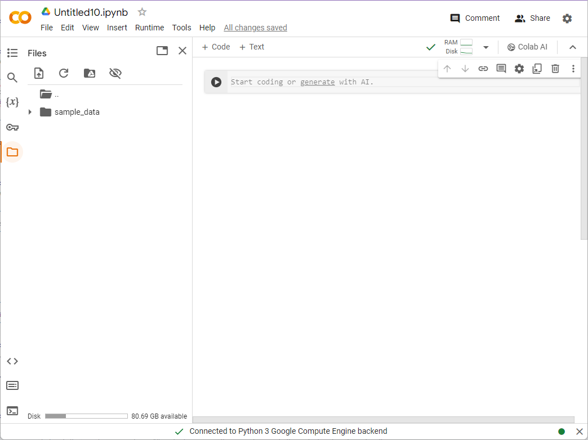
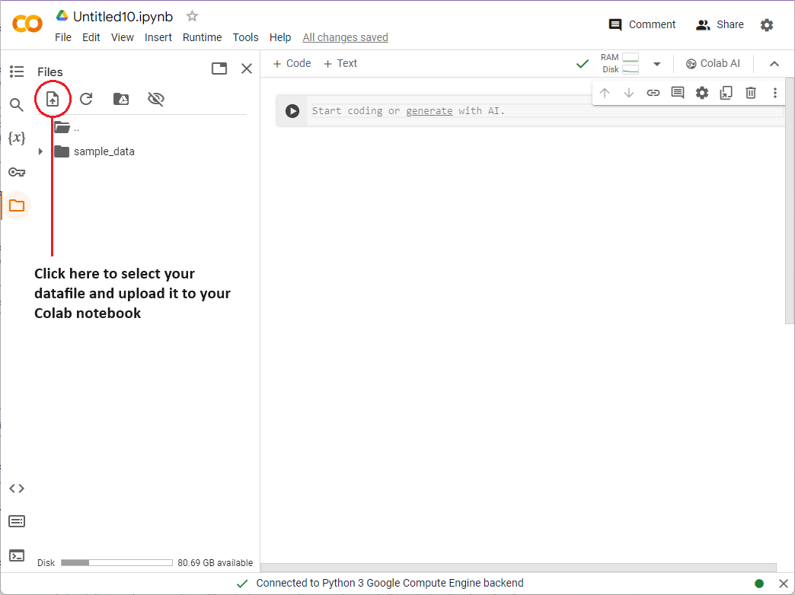
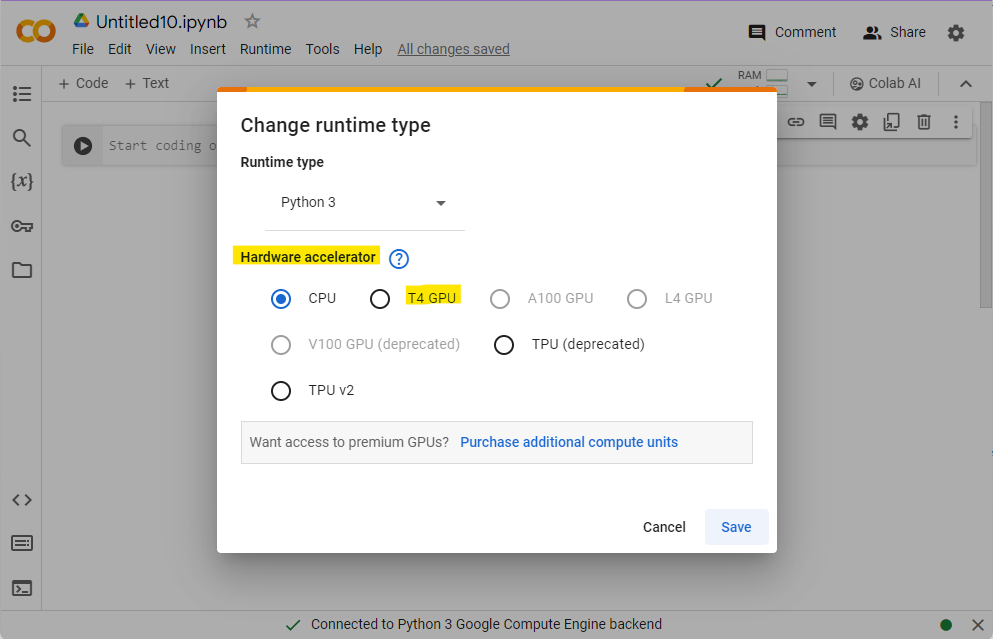
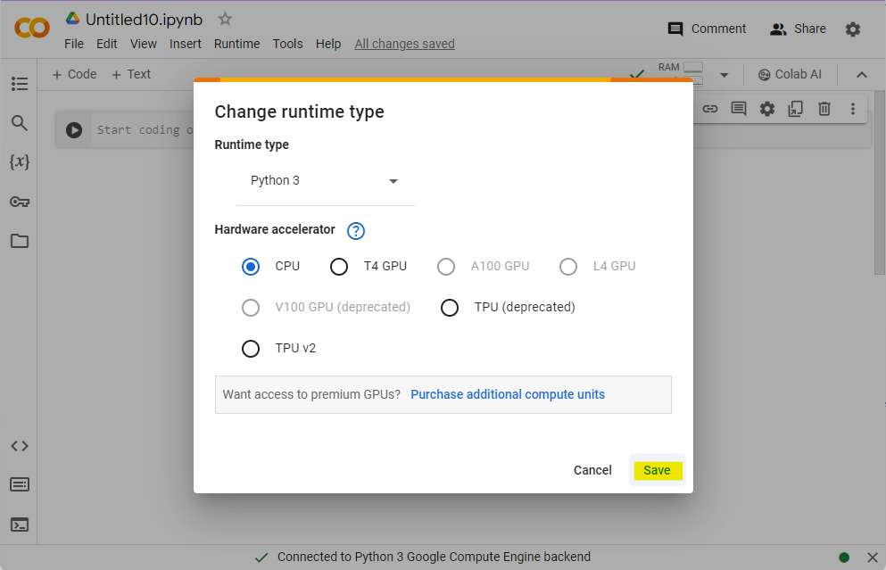
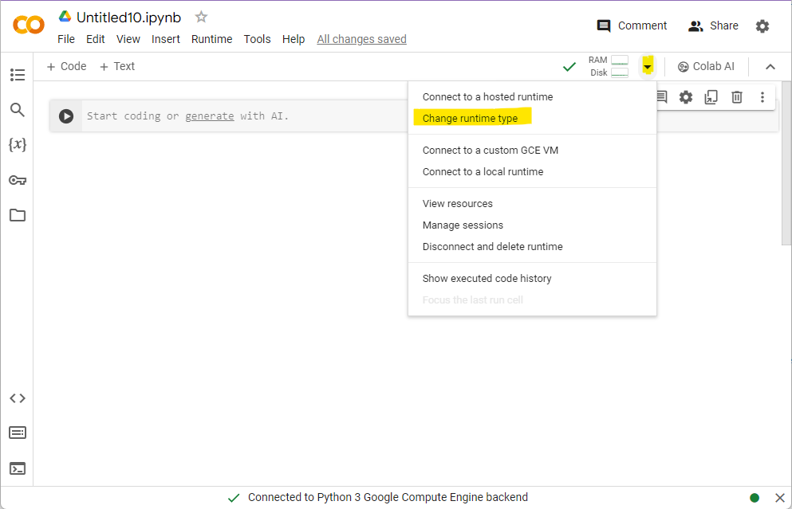

This workshop offers a hands-on introduction to Natural Language Processing (NLP) for research, utilizing the power of Google Colab for an interactive coding experience. Spanning one full day or two half-days, participants will explore the fundamental concepts and state-of-the-art techniques that enable machines to understand human language, opening up its applications across various research domains. Designed for Software Carpentry learners with a basic understanding of Python, this workshop is perfect for those eager to apply NLP in diverse fields. It’s an excellent opportunity for researchers seeking to augment their work, develop innovative tools, or deepen their comprehension of language processing technologies.


### Collaborative Learning

We emphasize collaborative learning and encourage participants to engage with peers throughout the workshop. Activities are designed for group interaction, but individual learners will also find the content enriching and manageable.


### Learning Objectives 

Participants will leave the workshop with the ability to:

- Conduct text cleaning and preprocessing.
- Conduct text analysis such as named entity recognition and summarization
- Apply vector space models and embeddings.
- Implement more advanced NLP techniques with transformers.
- Utilize transformers and large language models for advanced NLP tasks.
- Explore domain-specific LLMs and engage in prompt engineering.


::::::::::::::::::::::::::::::::::::::::: callout

Please note that before the workshop, participants should have already a basic knowledge of:

- Python programming, and completed [Plotting and Programming in Python](https://swcarpentry.github.io/python-novice-gapminder/) and/or [Programming with Python](https://swcarpentry.github.io/python-novice-inflammation/)
- Machine Learning (for the first part of the workshop),
- Deep Learning (for the second part of the workshop).
  
:::::::::::::::::::::::::::::::::::::::::::::::::


## Software Setup

Google Colab provides a free cloud-based Python environment that facilitates coding directly in your browser, with zero configuration required, easy sharing, and access to different processing units like CPU, GPU, and TPU.


## Setup Your Colab Notebook

1. **Create a Google Account**: If you do not already have a Google account, sign up at *accounts.google.com*.
2. **Access Google Colab**: Visit *colab.research.google.com* and sign in with your Google account.
3. **Familiarize Yourself** with Colab Notebooks; Colab notebooks are just like Jupyter notebooks.
4. If you are new to Colab, check out Colab’s introductory guide: [Google Colaboratory](https://colab.google/)
5. **Set Up Your Workspace**:
   a. Create a new notebook via ‘File’ > ‘New notebook’.
   b. Rename your notebook to reflect the workshop content, e.g., ‘Introduction_to_NLP_Workshop’.
7. **Install Required Libraries**: At the start of your notebook, use *!pip install* commands to install any required libraries.
   For the first part of the workshop:

```python
!pip install nltk spacy gensim textblob

```
8. **Mount Google Drive (Optional)**: If you want to access files from your Google Drive, you can mount it using:
```python
from google.colab import drive
drive.mount('/content/drive')
```
9. **Upload Datasets**: You can upload datasets directly to your Colab environment or access them from Google Drive.

You can upload your data file either via drag and drop it to the main directory (see the following image) or by clicking on the upload icon on the page (see the screenshot image)

The main window when you start with a new Colab notebook:



```
Drag and Drop
```

```
Click on the link and select the file
```


10. **Changing Hardware Accelerator**:
  In Google Colab, hardware accelerators are dedicated processors that boost computational efficiency, facilitating faster execution of operations such as machine learning model training, intricate simulations, and large-scale data analysis. To learn more about the available free hardware and runtimes check out this [link](https://research.google.com/colaboratory/faq.html#gpu-availability). We can change the accelerator through the following steps:

```
Click on the Runtime menu.
Select Change Runtime Type.
```


```
Choose GPU from the dropdown menu and click Save.
```




```
You can get to the same setting window through the Runtime small icon on the top right side of the screen.
```


11. **Save Your Work**: Colab auto-saves your notebooks to Google Drive, but you can also save a copy via ‘File’ > ‘Save a copy in Drive’.


::::::::::::::::::::::::::::::::::::::::: callout

Please note that these are free resources and we do not have to pay for using them. However, if you are using a paid Colab plan, you can also access premium GPUs like the V100 or A100 by upgrading your notebook’s GPU settings in the Runtime > Change runtime type menu. Additionally, paid plans provide access to high-memory virtual machines and longer runtimes. 

:::::::::::::::::::::::::::::::::::::::::::::::::

::::::::::::::::::::::::::::::::::::::::: callout

Another option that you may want to consider is to use Jupyter Notebooks. In such a case, you may follow the steps highlighted in the webpage discussing how to set up a [Jupyter Notebook](https://swcarpentry.github.io/python-novice-inflammation/index.html#option-a-jupyter-notebook)

:::::::::::::::::::::::::::::::::::::::::::::::::


::::::::::::::::::::::::::::::::::::::::: callout

This workshop is designed to be inclusive and accessible, using Google Colab to ensure equitable processing power for all participants. Please ensure you have a stable internet connection for the duration of the workshop.
  
:::::::::::::::::::::::::::::::::::::::::::::::::

